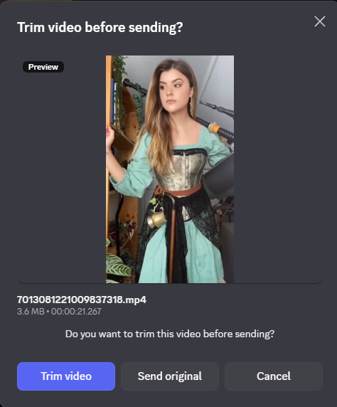

<div align="center">

# ✂️ Clipify

**Trim videos before sending them — without ever leaving Discord.**

A [Vencord](https://vencord.dev/) / [Equicord](https://equicord.org/) userplugin that intercepts video uploads, asks whether you want to trim, and opens a frame-accurate trim editor built right into the client.

[](https://vencord.dev/)
[](https://equicord.org/)
[](#-license)
[](https://github.com/ffmpegwasm/ffmpeg.wasm)

</div>

---

## Overview

Drop, paste, or attach a video in any channel or DM and Clipify steps in **before** it reaches the composer. Decide in one click whether to send the clip as-is or trim it down to just the part that matters — frame by frame, with a live preview and timeline scrubber that match Discord's native look and feel.

Everything runs **locally in your client**. Your video is never uploaded to any third-party service.

<div align="center">

| Choice prompt | Trim editor |
| :-----------: | :---------: |
|  |  |

</div>

## Features

- **🎯 Upload interception** — catches video uploads in the message composer and prompts you: *Trim* or *Send original*. Non-video files and any additional videos in the same drop pass straight through, untouched.
- **🎬 Frame-accurate editor** — scrub the timeline, set in/out points, step a single frame at a time, and preview your exact selection in a Discord-styled modal.
- **⚙️ Two trim engines** — pick precision or full offline operation (see [comparison](#trim-engines)).
- **🎚️ Quality presets** — High / Medium / Low, mapped to sensible CRF and bitrate values for each engine.
- **⏯️ Cancellable exports** with live progress — abort a long encode at any time.
- **🔒 Local-only & private** — no telemetry, no uploads. The only network request is a one-time fetch of the FFmpeg core (see [notes](#notes--privacy)).

## Trim engines

| | **FFmpeg** *(recommended)* | **MediaRecorder** |
| --- | --- | --- |
| **How** | `ffmpeg.wasm` running in-client | Browser-native real-time re-encode |
| **Precise mode** | ✅ Exact-frame cut, re-encoded to `.mp4` | ✅ Frame-accurate |
| **Lossless mode** | ✅ Instant stream-copy, zero quality loss¹ | ❌ |
| **Output** | `.mp4` (precise) / original container (lossless) | `.webm` |
| **Speed** | Fast; lossless is near-instant | Real-time (a 30s clip takes ~30s) |
| **Network** | One-time ~30 MB core download² | None — fully offline |

> ¹ In lossless mode the start point snaps to the nearest preceding keyframe (a fundamental trade-off of stream-copying).
> ² The core is fetched from [jsDelivr](https://www.jsdelivr.com/), which is allow-listed in Discord's CSP. Cached by the browser after first use.

## Keyboard shortcuts

| Key | Action |
| --- | --- |
| <kbd>Space</kbd> | Play / pause selection |
| <kbd>←</kbd> / <kbd>→</kbd> | Step 1 frame back / forward |
| <kbd>Shift</kbd> + <kbd>←</kbd> / <kbd>→</kbd> | Jump 10 frames back / forward |
| <kbd>I</kbd> | Set selection **start** to current frame |
| <kbd>O</kbd> | Set selection **end** to current frame |
| <kbd>Home</kbd> | Jump to selection start |
| <kbd>End</kbd> | Jump to selection end |

## Configuration

Configure under **Settings → Plugins → Clipify**.

| Setting | Default | Description |
| --- | --- | --- |
| **Intercept uploads** | On | Ask before sending a video upload. |
| **Engine** | FFmpeg | Trim engine — FFmpeg (precise/lossless) or MediaRecorder (offline). |
| **Trim mode** | Precise | FFmpeg only — *Precise* (exact frame, re-encodes) or *Fast* (lossless keyframe). |
| **Export quality** | High | High / Medium / Low (CRF for FFmpeg precise, bitrate for MediaRecorder). |
| **Frame rate** | 30 | Assumed FPS used for frame-by-frame navigation in the editor. |

## Supported input formats

`mp4` · `webm` · `mov` · `mkv` · `avi` · `m4v` · `mpg` · `mpeg` · `wmv` · `flv` · `ts` · `3gp` · `ogv`

Detection prefers the file's MIME type and falls back to the extension, so pasted blobs without a MIME type are still recognised.

## Installation

Clipify is a **userplugin** and requires a development build of Vencord or Equicord.

1. Clone this repository into your client's userplugins directory:
   ```bash
   git clone https://github.com/Overocai/Clipify.git src/userplugins/Clipify
   ```
2. Rebuild and inject the client:
   ```bash
   pnpm build && pnpm inject
   ```
3. Restart Discord and enable **Clipify** under **Settings → Plugins**.

> New to custom plugins? See the official guide: [Installing custom plugins](https://docs.vencord.dev/installing/custom-plugins/).

## Notes & privacy

- **No uploads.** Trimming happens entirely in your client. Clipify never sends your media to a third-party server.
- **The single network request** is a one-time download of the FFmpeg WebAssembly core from jsDelivr, only when you first use the FFmpeg engine. Prefer fully-offline operation? Switch the engine to **MediaRecorder**.
- Only the **first** video in a multi-file drop is opened in the editor; remaining videos and other attachments are forwarded to Discord's normal upload flow unchanged.

## License

Released under the **[GPL-3.0-or-later](https://www.gnu.org/licenses/gpl-3.0.html)** license.

<div align="center">

Made with ✂️ by [**overocai**](https://github.com/Overocai)

</div>
